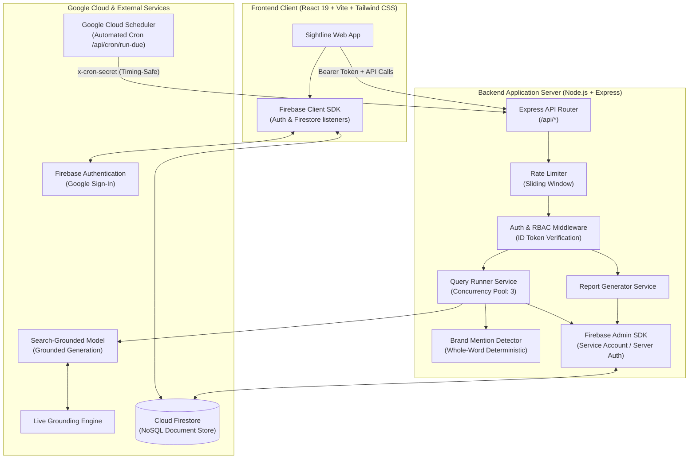
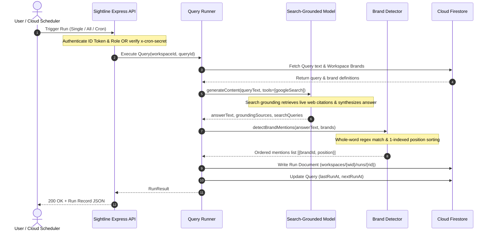

# Sightline Architecture & System Design

Sightline tracks whether and how brands appear in AI-generated answers with Google Search grounding. This document details the system topology, Firestore data model, mathematical metric definitions, and end-to-end execution pipeline.

---

## 1. System Topology & Architecture



---

## 2. Firestore Data Model

Sightline uses a hierarchical document structure scoped under workspaces to guarantee tenant data isolation.

### 2.1 Schema Overview

```
users/{uid}
workspaces/{wid}
  ├── members/{uid}
  ├── brands/{bid}
  ├── queries/{qid}
  ├── runs/{rid}
  └── reports/{repId}
```

### 2.2 Collections and Document Specifications

#### `users/{uid}`
Stores user account profiles synced upon authentication.
- `uid`: string (Primary Key, matches Firebase Auth UID)
- `displayName`: string | null
- `email`: string
- `photoURL`: string | null
- `createdAt`: ISO 8601 string

#### `workspaces/{wid}`
Root workspace document.
- `id`: string (e.g. `ws_98abc123`)
- `name`: string (1-100 characters)
- `ownerId`: string (User UID of workspace creator)
- `createdAt`: ISO 8601 string

#### `workspaces/{wid}/members/{uid}`
Subcollection defining workspace membership and Role-Based Access Control (RBAC).
- `uid`: string (User UID)
- `role`: `'owner' | 'analyst' | 'viewer'`
- `email`?: string (Optional cached display email)
- `addedAt`: ISO 8601 string

#### `workspaces/{wid}/brands/{bid}`
Primary brand and tracked competitor brands.
- `id`: string (e.g. `b_brand123`)
- `name`: string (Brand name, e.g. "Acme", 1-100 chars)
- `aliases`: string[] (Alternative names or spellings used in mentions detection)
- `website`?: string (Domain/URL)
- `kind`: `'own' | 'competitor'` (Only one primary 'own' brand per workspace)
- `createdAt`: ISO 8601 string
- `isSample`?: boolean (True if seeded via demo data generator)

#### `workspaces/{wid}/queries/{qid}`
Monitored prompt questions.
- `id`: string (e.g. `q_query123`)
- `text`: string (Search/prompt text, 1-500 chars)
- `category`: string (Logical grouping, e.g. "Product Comparison", "General")
- `frequency`: `'daily' | 'weekly' | 'manual'`
- `active`: boolean
- `lastRunAt`: ISO 8601 string | null
- `nextRunAt`: ISO 8601 string | null
- `createdAt`: ISO 8601 string
- `isSample`?: boolean

#### `workspaces/{wid}/runs/{rid}`
Immutable execution records generated exclusively by the server Admin SDK.
- `id`: string (e.g. `run_abc123`)
- `queryId`: string (References `queries/{qid}`)
- `queryText`: string
- `model`: string (e.g. `'grounded-search'`)
- `status`: `'completed' | 'failed'`
- `startedAt`: ISO 8601 string
- `answerText`?: string (Synthesized grounded answer)
- `mentions`: Array of:
  - `brandId`: string
  - `brandName`?: string
  - `position`: number (1-indexed rank of appearance in text)
- `sources`: Array of:
  - `title`: string
  - `url`: string
  - `domain`: string (Extracted hostname)
- `error`?: string
- `isSample`?: boolean

#### `workspaces/{wid}/reports/{repId}`
Periodic aggregated analytics snapshots.
- `id`: string
- `periodStart`: ISO 8601 string
- `periodEnd`: ISO 8601 string
- `visibilityScore`: number (0-100)
- `avgPosition`: number
- `shareOfVoice`: Array of:
  - `brandId`: string
  - `brandName`: string
  - `kind`: `'own' | 'competitor'`
  - `mentionCount`: number
  - `sharePercentage`: number (0-100)
  - `avgPosition`: number
- `topSources`: Array of:
  - `domain`: string
  - `citationCount`: number
- `runCount`: number
- `generatedAt`: ISO 8601 string
- `isSample`?: boolean

---

## 3. Metric Definitions & Formulas

Sightline's core metrics measure presence, prominence, and market context in AI-generated answers.

### 3.1 Visibility Score
**Definition**: The percentage of completed query runs within a given evaluation window in which the user's primary brand (`kind === 'own'`) was detected in the synthesized grounded response.

$$\text{Visibility Score} = \begin{cases} 
\text{round}\left(\frac{R_{\text{own}}}{R_{\text{total}}} \times 100\right), & \text{if } R_{\text{total}} > 0 \\ 
0, & \text{if } R_{\text{total}} = 0 
\end{cases}$$

- $R_{\text{own}}$: Number of runs with at least one mention of the primary brand.
- $R_{\text{total}}$: Total number of completed runs in the period.
- **Range**: $0\%$ to $100\%$. Higher is better.

### 3.2 Average Position
**Definition**: The average 1-indexed order of appearance of the primary brand among all recognized brands (own brand and competitors) within runs where the primary brand was mentioned.

$$\text{Average Position} = \begin{cases} 
\text{round}\left(\frac{\sum_{i=1}^{M_{\text{own}}} P_i}{M_{\text{own}}}, 1\right), & \text{if } M_{\text{own}} > 0 \\ 
0, & \text{if } M_{\text{own}} = 0 
\end{cases}$$

- $P_i$: The 1-indexed rank position of the brand in mentioning run $i$ (Position 1 means the brand was the earliest mentioned brand in the text).
- $M_{\text{own}}$: Total number of runs mentioning the brand.
- **Interpretation**: Lower is better. Position `1.0` signifies prime prominence.

### 3.3 Share of Voice (SoV)
**Definition**: The proportion of all detected brand mentions (across own brand and all tracked competitor brands) attributed to a specific brand.

$$\text{Share of Voice}_b = \begin{cases} 
\text{round}\left(\frac{M_b}{\sum_{k \in B} M_k} \times 100\right), & \text{if } \sum_{k \in B} M_k > 0 \\ 
0, & \text{otherwise} 
\end{cases}$$

- $M_b$: Number of mentions of brand $b$.
- $B$: Set of all tracked brands in the workspace.
- **Constraint**: $\sum_{b \in B} \text{SoV}_b \approx 100\%$.

---

## 4. Run Pipeline Step by Step



### Detailed Pipeline Stages:
1. **Trigger & Authentication**:
   - Client sends `POST /api/workspaces/:wid/queries/:qid/run` with Firebase ID Token.
   - Or Google Cloud Scheduler sends `POST /api/cron/run-due` with `x-cron-secret`.
   - Rate limiting and role validation (Owner or Analyst) are applied.
2. **Context Retrieval**:
   - Query record is retrieved from Firestore.
   - All active workspace brands (names and aliases) are loaded.
3. **Grounded Execution**:
   - Server initializes `@google/genai` client using server-only `GEMINI_API_KEY`.
   - Model executes with search grounding enabled.
   - Real web search queries are conducted and live source URLs/titles are extracted.
4. **Deterministic Mention & Position Detection**:
   - Pure algorithm evaluates case-insensitive whole-word boundaries against the answer text:
     $$\text{Pattern: } \backslash b\text{Term}\backslash b$$
   - For every brand matching on name or any alias, the character offset of its first appearance is recorded.
   - Mentions are sorted in ascending order of first appearance to assign 1-indexed rank positions ($1, 2, 3, \dots$).
5. **Persistence & Recalculation**:
   - The run record is saved to `workspaces/{wid}/runs/{rid}` via Firebase Admin SDK.
   - The query's `lastRunAt` timestamp is updated, and `nextRunAt` is calculated according to the frequency schedule.
